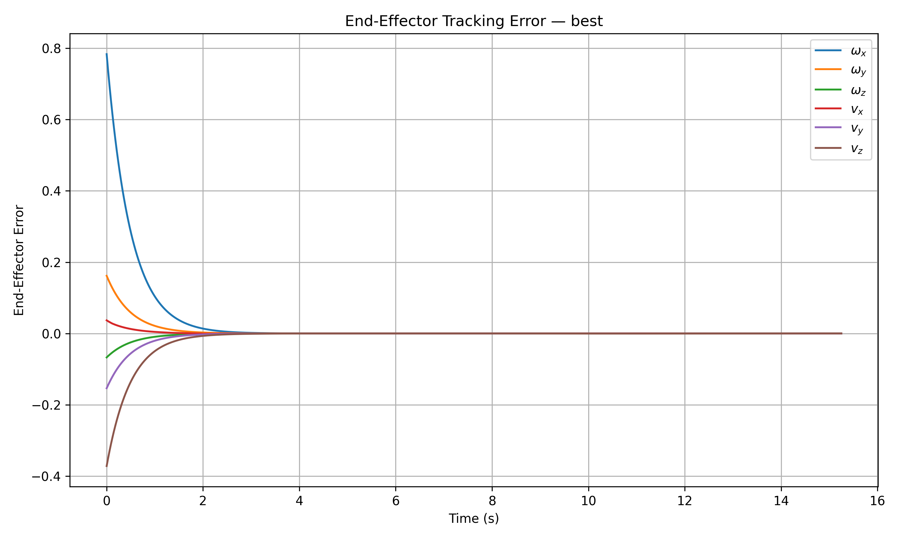
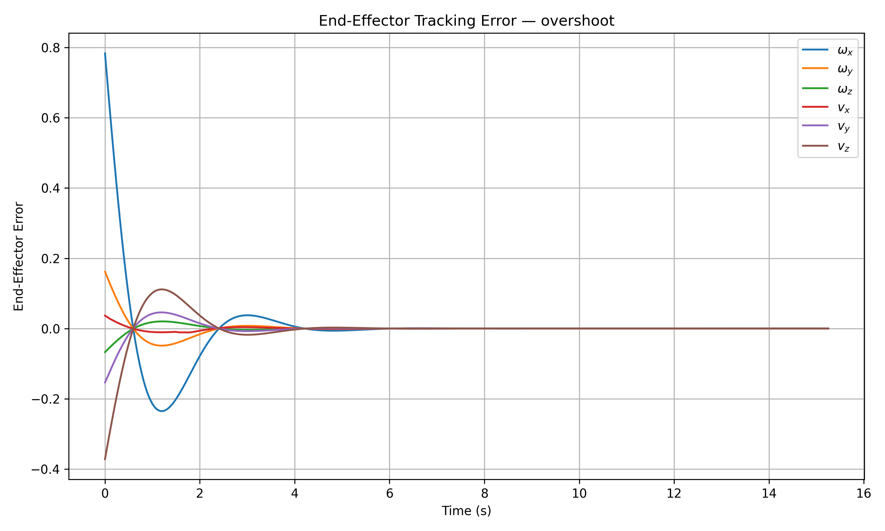
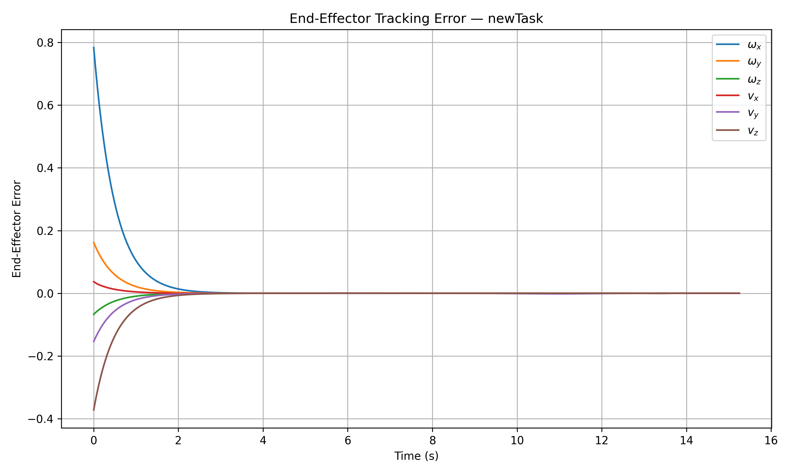

# Mobile Manipulation Control for the KUKA youBot

A kinematic planning and control pipeline for a **KUKA youBot mobile manipulator** performing autonomous cube pick-and-place tasks.

This project was developed as the capstone for the **Modern Robotics: Mechanics, Planning, and Control** specialization. It integrates mobile-base odometry, manipulator kinematics, trajectory generation, task-space feedback control, Jacobian pseudoinverse control, and joint-limit avoidance.

## Demo Tasks

Three final controller cases were implemented:

| Case | Controller | Behavior |
|---|---|---|
| **Best** | Feedforward + P | Tracking-focused baseline; no joint-limit enforcement |
| **Overshoot** | Feedforward + PI | Deliberate damped oscillation before convergence |
| **New Task** | Feedforward + P + joint-limit avoidance | Custom cube task with predictive limit checking and posture control |

## Results

### Best Controller

- `Kp = 2I`
- `Ki = 0`
- Initial error norm: `0.8986`
- Error at end of first trajectory segment: `3.34e-05`
- Final error norm: approximately `1.02e-04`
> **Joint-limit note:** The Best controller is a tracking-focused
> baseline and does not enforce arm joint limits. Joint-limit
> avoidance is implemented separately in the New Task controller.



### Overshoot Controller

- `Kp = 2I`
- `Ki = 4I`
- Demonstrates intentional overshoot and damped oscillation
- Error converges sufficiently before the grasp operation
- Final error norm: approximately `2.40e-05`



### Custom Pick-and-Place Task

Cube configurations:

- Initial: `(x, y, phi) = (1.0, 0.5, 0)`
- Goal: `(x, y, phi) = (-0.5, -1.0, pi/2)`

The custom task also includes:

- predictive joint-limit checking
- Jacobian-column disabling for violating joints
- null-space posture control
- pseudoinverse singular-value tolerance

The controller successfully completed the pick, transport, placement, and retreat while remaining within the selected arm-joint limits.

- Initial error norm: `0.8986`
- Error at end of first trajectory segment: `3.84e-05`
- Final error norm: approximately `2.07e-04`



## Control Architecture

The overall pipeline is:

```text
Reference Trajectory
        |
        v
Task-Space Feedback Controller
        |
        v
Desired End-Effector Twist V
        |
        v
Mobile-Manipulator Jacobian Je
        |
        v
Jacobian Pseudoinverse
        |
        v
Wheel + Arm Joint Velocities
        |
        v
youBot Kinematic Simulator
        |
        v
Updated Robot Configuration
```

The task-space controller implements

```text
V = Ad(X^-1 Xd) Vd + Kp Xerr + Ki integral(Xerr) dt
```

where:

- `X` is the actual end-effector configuration
- `Xd` is the desired reference configuration
- `Vd` is the feedforward reference twist
- `Xerr` is the task-space configuration error
- `Kp` is the proportional gain matrix
- `Ki` is the integral gain matrix

The wheel and arm controls are calculated using

```text
[u, theta_dot] = Je^dagger V
```

where `Je` is the full `6 x 9` mobile-manipulator Jacobian containing the four wheel degrees of freedom and five arm-joint degrees of freedom.

## Mobile Base Kinematics

The youBot uses four mecanum wheels, allowing:

- forward/backward translation
- lateral translation
- rotation about the vertical axis
- combinations of translation and rotation

The kinematic simulator implements:

- wheel-speed integration
- arm joint integration
- mecanum-wheel odometry
- chassis body-twist calculation
- body-to-space frame transformation
- first-order Euler integration

The simulation timestep is:

```text
dt = 0.01 s
```

The chassis configuration is represented by:

```text
[phi, x, y]
```

and the complete simulated robot state contains:

```text
[phi, x, y,
 J1, J2, J3, J4, J5,
 W1, W2, W3, W4]
```

## Trajectory Generation

The end-effector reference trajectory contains eight segments:

1. Move from the initial end-effector pose to a standoff pose above the cube
2. Descend to the grasp pose
3. Close the gripper
4. Return to the initial standoff pose
5. Move to a standoff pose above the goal
6. Descend to the placement pose
7. Open the gripper
8. Retreat to the final standoff pose

Quintic screw trajectories from the Modern Robotics library are used to generate smooth motion between poses.

The gripper is held stationary long enough during opening and closing to allow the simulated gripper motion to complete.

## End-Effector Feedback Control

The controller combines feedforward trajectory tracking with proportional and integral feedback.

The configuration error is computed from

```text
Xerr = se3ToVec(MatrixLog6(X^-1 Xd))
```

and the reference feedforward twist is computed from

```text
Vd = (1 / dt) *
     se3ToVec(MatrixLog6(Xd^-1 Xd_next))
```

The desired twist is then mapped into wheel and arm-joint speeds using the pseudoinverse of the mobile-manipulator Jacobian.

## Mobile-Manipulator Jacobian

The full Jacobian is constructed as:

```text
Je = [Jbase  Jarm]
```

where:

- `Jbase` maps mecanum-wheel motion to end-effector motion
- `Jarm` is the five-joint body Jacobian of the arm

The base Jacobian is transformed into the end-effector frame using the adjoint representation.

The resulting matrix has dimensions:

```text
6 x 9
```

corresponding to six end-effector twist components and nine available robot controls.

## Initial Tracking Error

For the final controller experiments, the actual robot configuration was intentionally initialized away from the beginning of the reference trajectory.

The initial mismatch was approximately:

- Position error: `0.393 m`
- Orientation error: `46.0 degrees`

This allows the effect of feedback control to be clearly observed.

With feedforward control only, the initial error remains almost unchanged.

With feedback enabled, the controller drives the error toward zero before the grasp.

## Joint-Limit Avoidance

During development of the custom task, unrestricted pseudoinverse control produced mathematically valid end-effector tracking but physically undesirable arm configurations.

To improve the motion, an enhanced controller was implemented.

The joint-limit avoidance logic described below is used by
`run_new_task.py`. The Best and Overshoot cases use the standard
unconstrained Jacobian-pseudoinverse control path.

### Predictive Joint-Limit Checking

At each timestep, the next arm configuration is predicted using

```text
theta_next = theta + theta_dot * dt
```

If a joint would violate its allowed range:

1. the corresponding arm-joint column of `Je` is set to zero
2. the pseudoinverse is recalculated
3. the remaining joints and mobile base are used to generate the requested end-effector motion

### Null-Space Posture Control

Because the mobile manipulator has nine controls for a six-dimensional task, the system is redundant.

A secondary posture-control objective is projected into the Jacobian null space:

```text
q_dot =
    Je^dagger V
    +
    (I - Je^dagger Je) q_dot_0
```

This biases the arm toward a preferred bent configuration while minimizing interference with the primary end-effector tracking task.

### Joint Ranges

The arm joint limits were identified using the interactive KUKA youBot model in CoppeliaSim:

| Joint | Minimum (rad) | Maximum (rad) |
|---|---:|---:|
| J1 | -2.932 | 2.932 |
| J2 | -1.117 | 1.553 |
| J3 | -2.500 | 2.500 |
| J4 | -1.780 | 1.780 |
| J5 | -2.890 | 2.890 |

A larger pseudoinverse singular-value tolerance is also used in the enhanced controller to reduce sensitivity near singular configurations.

## Validation

The project was developed incrementally and each major component was tested independently before full integration.

Validation includes:

- mecanum-wheel odometry
- forward chassis motion
- lateral chassis motion
- in-place chassis rotation
- actuator speed limiting
- body-to-space frame conversion
- youBot forward kinematics
- arm body Jacobian
- mobile-base Jacobian
- full mobile-manipulator Jacobian
- feedforward twist calculation
- Jacobian pseudoinverse controls
- initial configuration error
- joint-limit detection
- full feedforward simulation
- feedback-controller convergence

For example:

```bash
python tests/test_feedback_control.py
```

produces the Modern Robotics reference feedforward values approximately equal to:

```text
Vd =
[0, 0, 0, 20, 0, 10]

Controls =
[157.2, 157.2, 157.2, 157.2,
 0, -652.9, 1398.6, -745.7, 0]
```

## Project Structure

```text
.
├── src/
│   ├── feedback_control.py
│   ├── next_state.py
│   ├── plot_errors.py
│   ├── run_best.py
│   ├── run_new_task.py
│   ├── run_overshoot.py
│   └── trajectory_generator.py
│
├── tests/
│   ├── test_csv.py
│   ├── test_feedback_control.py
│   ├── test_feedback_kinematics.py
│   ├── test_final_initial_error.py
│   ├── test_joint_limits.py
│   ├── test_next_state_basic.py
│   ├── test_odometry_matrix.py
│   └── test_setup.py
│
├── examples/
│   ├── milestone1_test.py
│   ├── milestone3_feedforward.py
│   └── final_feedforward_test.py
│
├── results/
│   ├── milestone1/
│   ├── milestone2/
│   ├── milestone3/
│   ├── best/
│   ├── overshoot/
│   └── newTask/
│
├── requirements.txt
├── .gitignore
└── README.md
```

## Installation

Clone the repository and move into the project directory.

Create a Python virtual environment:

```bash
python3 -m venv .venv
```

Activate it on Linux/WSL:

```bash
source .venv/bin/activate
```

Install the dependencies:

```bash
pip install -r requirements.txt
```

The main Python dependencies are:

- NumPy
- Matplotlib
- Modern Robotics

## Running the Project

Run all commands from the repository root.

### Best Controller

```bash
python src/run_best.py
```

This generates the default pick-and-place trajectory using feedforward + proportional feedback.

### Overshoot Controller

```bash
python src/run_overshoot.py
```

This runs the intentionally less-well-tuned PI controller demonstrating overshoot and damped oscillation.

### Custom Task

```bash
python src/run_new_task.py
```

This runs the custom pick-and-place task with joint-limit avoidance and null-space posture control.

### Generate Error Plots

```bash
python src/plot_errors.py
```

## CoppeliaSim Visualization

The generated robot configuration CSV files can be played using:

```text
CoppeliaSim Scene 6:
CSV Mobile Manipulation youBot
```

The simulation uses configuration snapshots separated by `0.01 s`.

For the default task:

```text
Cube initial:
(x, y, phi) = (1, 0, 0)

Cube goal:
(x, y, phi) = (0, -1, -pi/2)
```

For the custom task:

```text
Cube initial:
(x, y, phi) = (1.0, 0.5, 0)

Cube goal:
(x, y, phi) = (-0.5, -1.0, pi/2)
```

## Key Files

### `next_state.py`

Implements the youBot kinematic simulator, including mecanum-wheel odometry and numerical state integration.

### `trajectory_generator.py`

Generates the complete eight-segment end-effector reference trajectory.

### `feedback_control.py`

Contains:

- forward kinematics
- task-space feedback control
- mobile-manipulator Jacobian
- pseudoinverse control
- joint-limit checking
- null-space posture control

### `run_best.py`

Runs the smooth well-tuned controller for the default task.

### `run_overshoot.py`

Runs the deliberately oscillatory controller case.

### `run_new_task.py`

Runs the custom cube task using the enhanced joint-limit-aware controller.

## Tools and Technologies

- Python
- NumPy
- Matplotlib
- Modern Robotics Python library
- CoppeliaSim
- Git
- WSL / Ubuntu

## Background

This project integrates concepts from across the Modern Robotics curriculum, including:

- rigid-body motions
- matrix exponentials and logarithms
- forward kinematics
- velocity kinematics
- Jacobians
- trajectory generation
- feedback control
- wheeled mobile-robot kinematics
- mobile manipulation

## Acknowledgment

This project is based on the **Mobile Manipulation Capstone** from Northwestern University's *Modern Robotics: Mechanics, Planning, and Control* curriculum.

The Modern Robotics Python library was used for rigid-body transformations, forward kinematics, Jacobians, trajectory generation, and related robotics operations.
